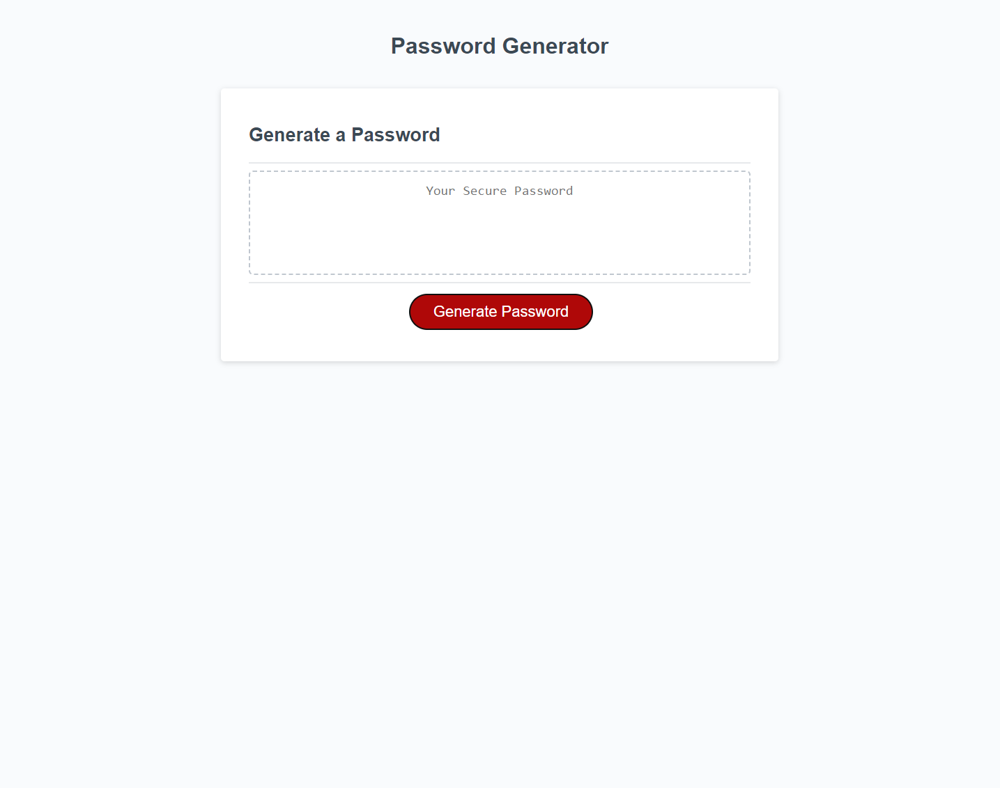

# Password Generator

[Link to my project](https://smoke5643.github.io/password-generator/)

## Table of Contents
- [Description](#description-of-project)
- [Visuals](#visuals)

## Description of project

This application is a random password generator. It allows a user to choose from uppercase letters, lowercase letters, numbers, and special characters. The user then inputs a number of characters for the password between 8 and 128. The password is then displayed on the screen to be copied and used elsewhere.

## Visuals

Preview of the password generator

